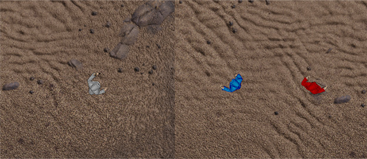
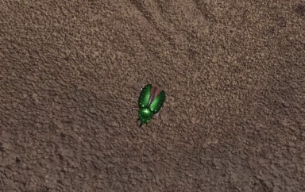

+++
title="Grumpy Visitors first update. Winter progress"
slug="2020-03-02-winter-update"
date=2020-03-02
category="Grumpy Visitors"
+++
Though this winter wasn't my most active season, some interesting updates worth highlighting were merged into master.
It was mostly the graphics that drew my attention, so this update will also be rich with screenshots.

But first of all, I'd like to show off some numbers.

Commits made: 39<BR>
Pull requests merged: 5<BR>
Code changes: <span style="color: #28a745">5,774++</span>  <span style="color: #cb2431">4,600--</span><!-- more --><BR>
Issues submitted to Amethyst: 2 (1 solved)<BR>
Pull requests sent to Amethyst: 2 (1 merged)

It'll be insteresting to see how those'll change in the next updates.

## Painting mage sprites

So the first thing I started working on in winter was painting my mage sprites. My original sprites render a mage in a white robe.
As Grumpy Visitors is a multiplayer game, I thought it's important to make players' characters distinguishable. So I decided to make several variants of the sprite set.. with a shader!



And the shader turned out to be not very ugly.
```glsl
void main() {
    vec3 brightest_white = vec3(0.76);
    vec3 darkest_white = vec3(0.57);                   // These two variables aren't
    vec3 white_diff = brightest_white - darkest_white; // used, but nevermind.

    vec4 color = texture(albedo, vertex.tex_uv);
    if (color.a == 0.0) {
        discard;
    }
    if (abs(color.r - color.g) < 0.02 && abs(color.g - color.b) < 0.02) {
        out_color = vec4(
            vertex.paint_color.rgb - (brightest_white - color.rgb),
            color.a
        );
    } else {
        out_color = color;
    }
}
```

## Spell particles

There's still an old screenshot on my github front page where you can see how the spell particle looked: [[the image]](https://github.com/amethyst/grumpy_visitors/blob/b0edb94c33d10b56b99df0b5bc88cce86fd8da97/header_screenshot.png)<BR>
Yes, it's just a red dot! Unacceptable, right? Here I thought digging into shaders would be a nice idea again.

So I wrote a [very basic particle system](https://github.com/amethyst/grumpy_visitors/commit/5e2602bae16179cd579926b1e6832348e063a77c),
then [made it a bit more complex](https://github.com/amethyst/grumpy_visitors/commit/a292da3e44d6f328d40135e2068bc78b1217dc0c)
and finally implemented a new `RenderGroup` and [drew a missile](https://github.com/amethyst/grumpy_visitors/commit/0d0f1929c468b1762b15a19706bcaffd16ff6030).

The code won't contain the full history of iterations though, luckily I shot some of them on a screen.. capture.. thing.

**Beware!! I'm an evil man who doesn't stop the radio before recording.**

<p align="center">
<iframe width="560" height="315" src="https://www.youtube.com/embed/xttzNwBmQTg" frameborder="0" allow="accelerometer; autoplay; encrypted-media; gyroscope; picture-in-picture" allowfullscreen></iframe>
</p>

And the final result with higher resolution:


## New animations

Ok, this is almost the end.. That's more of a promise to myself.

Several commits before you could observe that when several missiles landed on a beetle, a beetle disappeared.
That wasn't very nice looking.. So I decided to take the animations from my dusty sprites folder and finally add them to the game.
This also required refactoring some of my animation systems, which I was procrastinating to do before, so it was a good call for two reasons.

Now the game features tired beetles:

<p align="center">

<i style="display: block;">(and I'm also too tired to make a proper gif, sry)</i>
</p>

## Polishing UI

This, I think, is the largest one, and it's still not finished: [UI and MP enhancements #36](https://github.com/amethyst/grumpy_visitors/pull/36).

This one had several blockers on Amethyst side ([one of the PRs](https://github.com/amethyst/amethyst/pull/2155) is yet to be merged)
and required a lot of refactoring of my UI menu system. But some visible progress has already been made: half-working modal windows with cool fade-in/fade-out background transitions!

<video style="object-fit: cover" width="615" height="461" autoplay muted loop>
  <source src="modals.mp4" type="video/mp4" />
  Your browser does not support the video tag.
</video>

## Links

Thanks for reading! If you've got this far, you might as well be interested in these:

- reddit discussion (todo)
- twitter discussion (todo)

<hr/>

- [github.com/amethyst/grumpy_visitors](https://github.com/amethyst/grumpy_visitors)
- [#good-first-issue](https://github.com/amethyst/grumpy_visitors/issues?q=is%3Aopen+is%3Aissue+label%3A%22good+first+issue%22)
- https://discord.gg/amethyst in #showcase-game

(make the word counter sinister or grumpy even as well)
